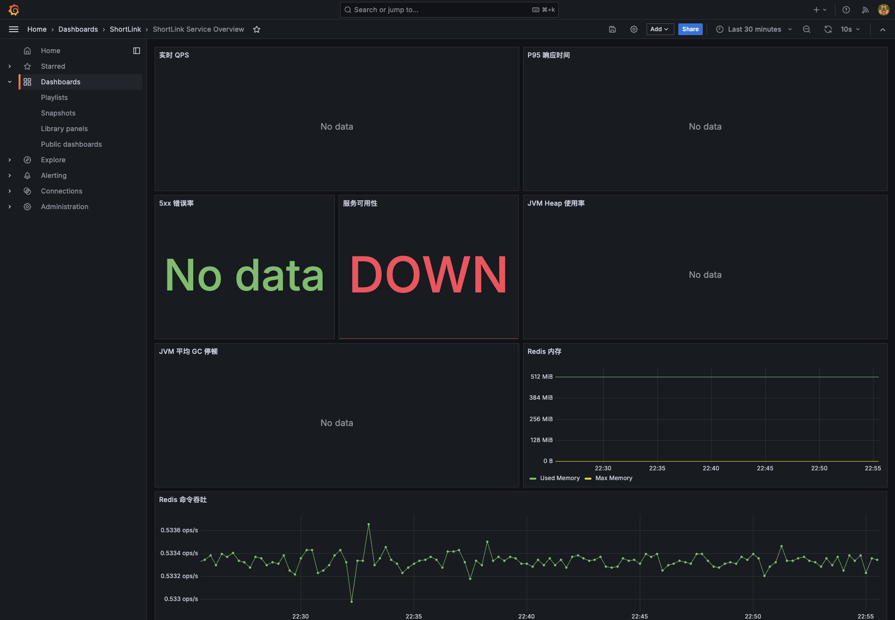
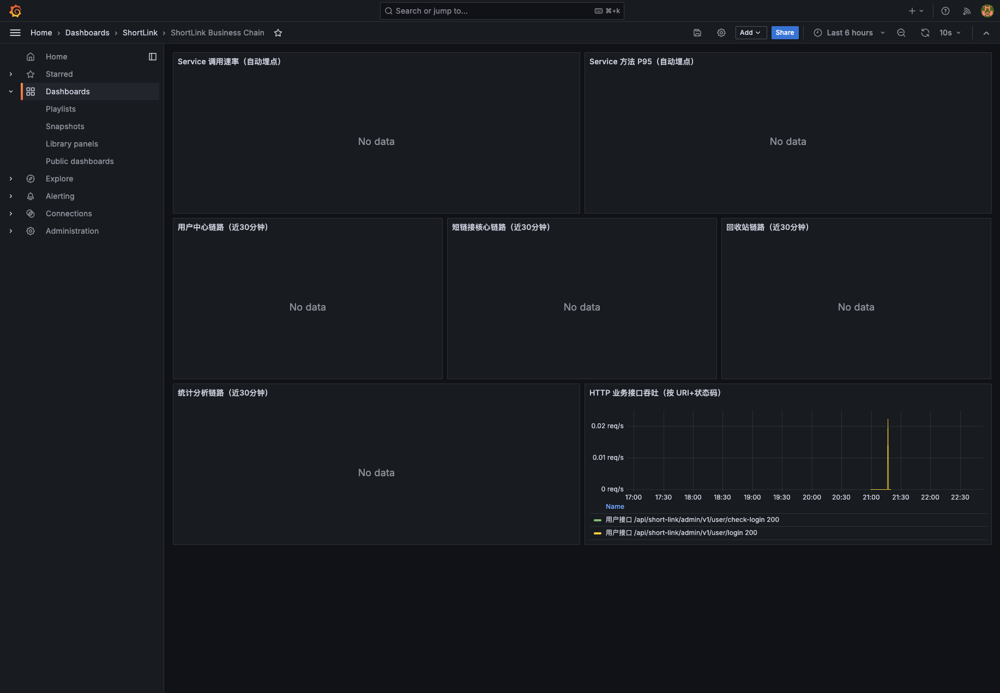
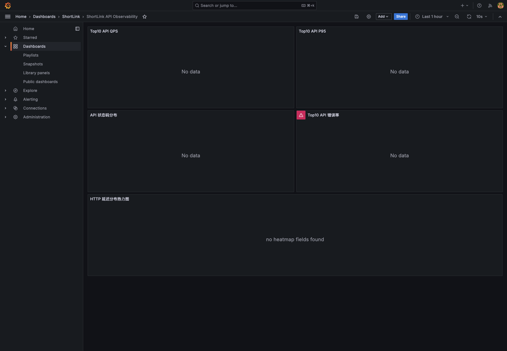
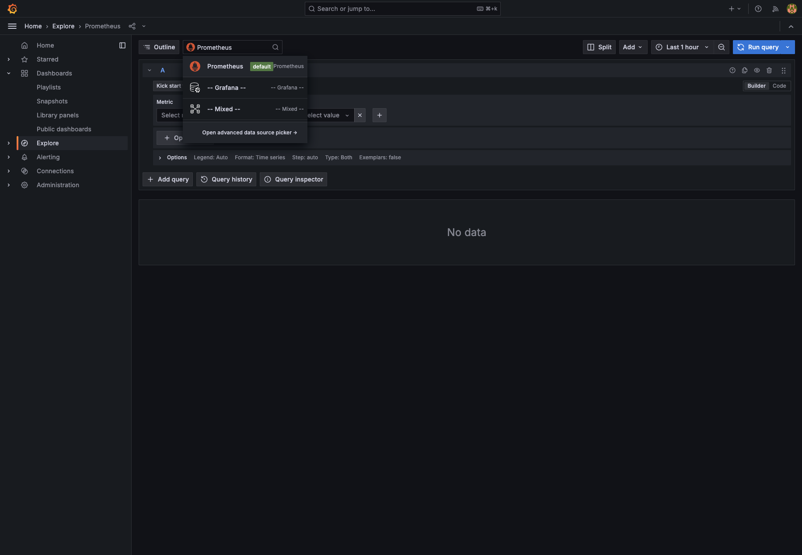

# 05 可观测性与日志监控体系（Prometheus + Grafana + Loki）

## 1. 体系目标
我们将“监控”分为三层：

- 指标监控（Metrics）：系统健康和业务指标趋势。
- 告警治理（Alerting）：异常自动触发告警。
- 日志检索（Logs）：问题发生后可快速定位。

## 2. 技术栈
- 指标采集：Spring Boot Actuator + Micrometer + Prometheus
- 可视化：Grafana（多看板）
- 告警：Alertmanager
- 日志：Loki + Promtail（容器日志集中化）

对应编排文件：`docker-compose.monitoring.yml`

## 3. 指标与看板分层
当前看板已经分成“总览 + 深入分析”：

- `ShortLink Service Overview`：QPS / P95 / 错误率 / JVM / Redis 总览
- `ShortLink Business Chain`：用户、短链、回收站、统计链路指标
- `ShortLink API Observability`：Top API QPS/P95/错误率/状态码分布
- `ShortLink JVM Runtime`：Heap、GC、线程、Tomcat线程池
- `ShortLink Redis Deep Dive`：命中率、连接、内存、IO、慢日志
- `ShortLink SLO & Error Budget`：可用性、错误预算、燃烧率

## 4. 告警规则（示例）
已配置核心告警：

- 服务不可用（Aggregation Down）
- 5xx 错误率过高
- P95 过高
- JVM 堆使用率过高
- Redis 不可用
- Redis 内存压力过高

## 5. 日志系统亮点（Loki）
- Promtail 自动采集 Docker 容器日志。
- Grafana Explore 直接使用 Loki 数据源做 LogQL 查询。
- 支持按 `container`、`compose_service`、关键字快速定位问题。

常用查询示例：

```logql
{container="shortlink"}
```

```logql
{container=~"shortlink-(aggregation|prometheus|redis-exporter)"} |= "error"
```

## 6. 监控看板截图（总览）


## 7. 监控看板截图（业务链路）


## 8. 监控看板截图（API可观测）


## 9. 日志检索截图（Grafana Explore + Loki）


## 10. 这套体系的价值
- 研发：快速定位性能/错误/依赖故障。
- 运维：从告警到日志定位闭环。
- 业务：可直接看到短链核心链路的实时运行状态。
