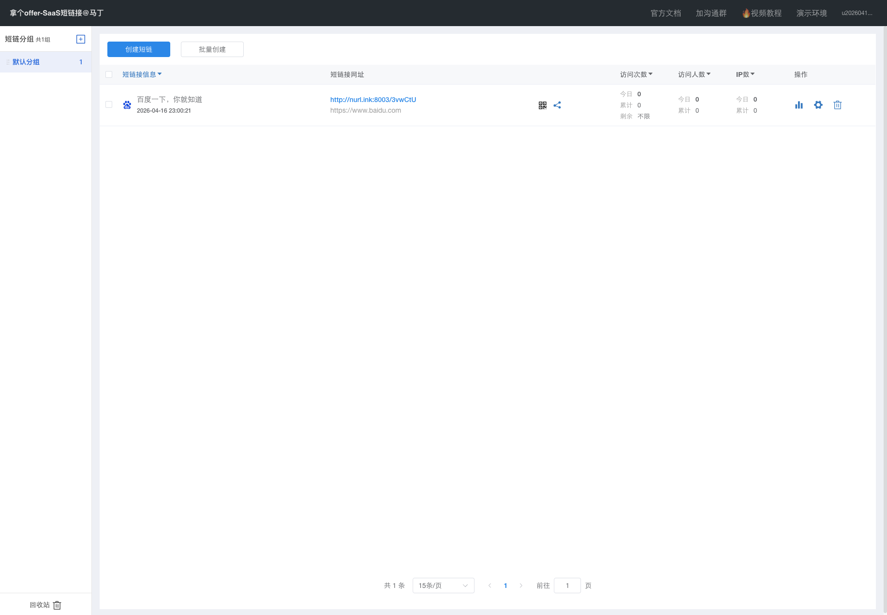

# 06 其他核心能力补充（除生成/跳转/统计之外）

## 1. 访问配额治理
这是本项目对“短链可控性”的关键增强：

- 创建/编辑时可设置访问上限 `max_access_count`。
- 跳转时原子扣减 `current_access_count`。
- 达到上限自动失效，并返回不可用结果。
- 管理端列表实时展示“剩余次数”。

这让短链可被用于限量活动、灰度投放、内容控流等场景。

## 2. 回收站机制
回收站并非简单删除，而是三段式管理：

- 移入回收站（逻辑失效）
- 恢复（可重新启用）
- 彻底删除（不可逆）

回收站分页、恢复、删除都已接入管理界面与后端服务。

## 3. 最小 RBAC 权限模型
已落地 `ADMIN/USER` 两级角色：

- 用户信息中展示角色。
- 管理员可以调整用户角色。
- 权限过滤器对关键接口做管理员校验（例如角色管理接口）。

这为后续细粒度权限（菜单、操作点）预留了可扩展空间。

## 4. 管理系统一致性能力
- 分组、回收站、统计、列表都围绕 `gid` 统一组织。
- 变更后缓存失效与锁策略已经联动，避免跳转数据和管理数据出现“看上去不一致”。

## 5. 页面效果示例

图中“今日/累计/剩余”体现了可运营性，不再只是“能跳就行”的简单短链系统。
