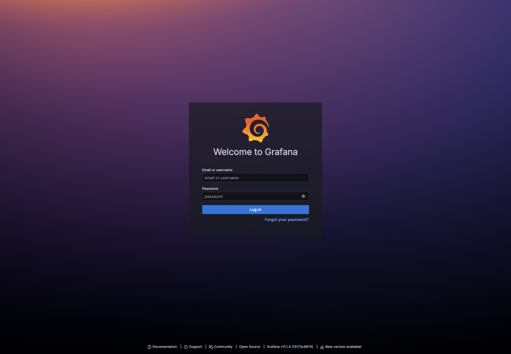

# 短链接系统功能说明与页面截图

## 1. 系统概述

本系统为一个面向短链接生成、管理、统计分析与运营增强的综合平台，主要围绕“短链接全生命周期管理”展开，覆盖用户认证、短链创建、分组管理、访问统计、回收站管理、个人中心以及监控运维等功能模块。

从实际实现来看，系统当前主要包含以下两类角色：

- 普通用户：注册、登录后使用短链接相关业务功能。
- 管理员：在普通用户能力基础上，可查看和维护用户角色及系统管理信息。

在文档组织上，为了更贴合系统实际能力，下面按功能模块而不是按角色进行说明。

## 2. 登录认证与系统入口

### 2.1 功能说明

- 用户可通过登录页输入账号和密码进入系统。
- 系统支持用户注册、登录态校验和退出登录。
- 登录成功后进入“我的空间”，开始进行短链接业务操作。

### 2.2 页面截图

图 2-1 登录页

## 3. 短链接工作台

### 3.1 功能说明

“我的空间”是系统最核心的业务工作台，主要提供以下能力：

- 查看当前用户名下的短链接列表。
- 按分组管理短链接。
- 查看短链接描述、原始链接、访问次数、访问人数、IP 数等基础信息。
- 执行创建、编辑、复制、查看二维码、删除等操作。
- 打开数据统计弹窗查看访问趋势。
- 打开运营增强中心查看风险分析与生命周期告警。

### 3.2 页面截图

图 3-1 短链接工作台“我的空间”

## 4. 短链接创建与维护

### 4.1 功能说明

系统支持用户创建新的短链接，并维护已有短链接信息。具体包括：

- 创建单条短链接。
- 填写跳转目标地址。
- 填写短链接描述信息。
- 对已有短链接进行编辑和维护。
- 支持批量创建短链接。

该模块是短链接业务的入口，也是系统最常用的基础功能之一。

### 4.2 页面截图

图 4-1 创建短链接弹窗

## 5. 数据统计与访问分析

### 5.1 功能说明

系统提供较完整的短链接统计分析能力，可用于查看短链接使用效果及访问行为，主要包括：

- 查看短链接基础信息。
- 统计访问次数。
- 统计访问人数。
- 统计独立 IP 数量。
- 查看访问趋势与时间范围内的变化情况。
- 查看历史访问记录。
- 从浏览器、设备、地区、网络、操作系统等维度进行访问分析。

该模块是系统区别于普通链接工具的重要能力，也是毕业设计中非常值得重点展示的功能。

### 5.2 页面截图

图 5-1 短链接数据统计弹窗

## 6. 运营增强中心

### 6.1 功能说明

为了进一步提升系统的可运营性，系统还提供了“运营增强中心”，主要用于展示更高层级的分析结果，包括：

- 分组运营总览。
- 高风险短链接识别。
- 生命周期告警分析。
- 短链接健康状态辅助判断。

这一部分体现了系统不仅能“生成短链”，还具备面向运营与风控的扩展能力。

### 6.2 页面截图

图 6-1 运营增强中心

## 7. 回收站管理

### 7.1 功能说明

系统支持将不再使用的短链接移入回收站，并提供后续处理能力，主要包括：

- 查看已删除的短链接记录。
- 恢复误删的短链接。
- 对短链接进行彻底删除。

回收站模块提高了数据管理的安全性，避免误删后无法恢复的问题。

### 7.2 页面截图

图 7-1 回收站页面

## 8. 个人中心与账户维护

### 8.1 功能说明

系统提供个人中心用于进行账户信息维护，主要包括：

- 查看当前登录用户信息。
- 修改个人资料。
- 返回我的空间继续业务操作。
- 管理员可对角色信息进行进一步维护。

该模块属于系统基础管理能力，保障用户账户信息的可维护性。

### 8.2 页面截图

图 8-1 个人中心页面

## 9. 监控与运维能力

### 9.1 功能说明

除业务前台外，项目还集成了监控与运维能力，用于保障系统稳定运行。当前可以结合监控平台完成以下工作：

- 监控系统运行状态。
- 查看接口与业务链路指标。
- 辅助排查系统异常。
- 为后续性能分析和运维展示提供支撑。

这一部分非常适合在毕业设计中作为“系统扩展能力”或“系统可观测性设计”进行描述。

### 9.2 页面截图

图 9-1 Grafana 登录页

## 10. 功能汇总

结合当前实际实现，本系统可以概括为以下几个核心功能方向：

- 用户注册、登录、退出和个人信息维护。
- 短链接创建、批量创建、编辑、删除和分组管理。
- 短链接访问统计与多维访问分析。
- 回收站恢复与永久删除。
- 运营增强分析与高风险短链识别。
- 监控运维与可观测性支撑。

## 11. 结论

总体来看，本短链接系统不仅实现了短链接生成与管理的基本业务流程，还在统计分析、运营增强和监控运维方面做了较完整的扩展，具备较强的实用性和展示价值。若用于毕业设计文档，可以将本说明作为“系统功能设计”或“系统功能展示”章节的基础材料，并结合数据库设计、接口设计和系统架构说明进一步完善整篇论文内容。
