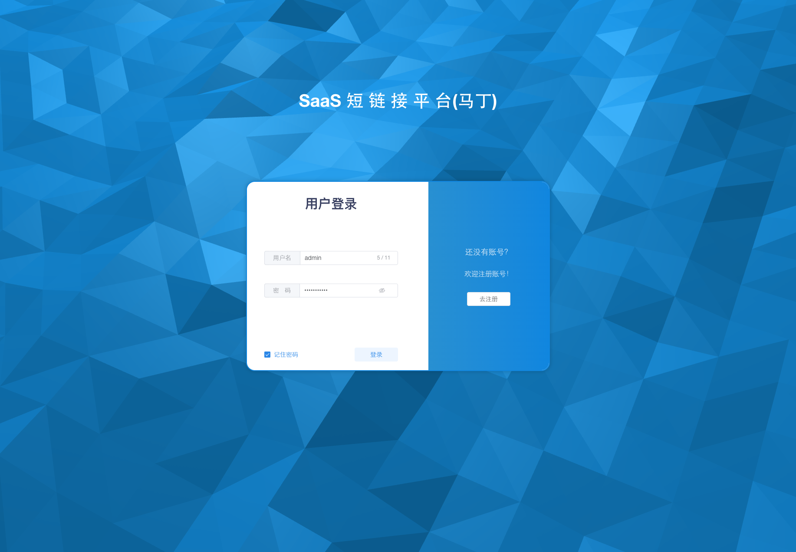
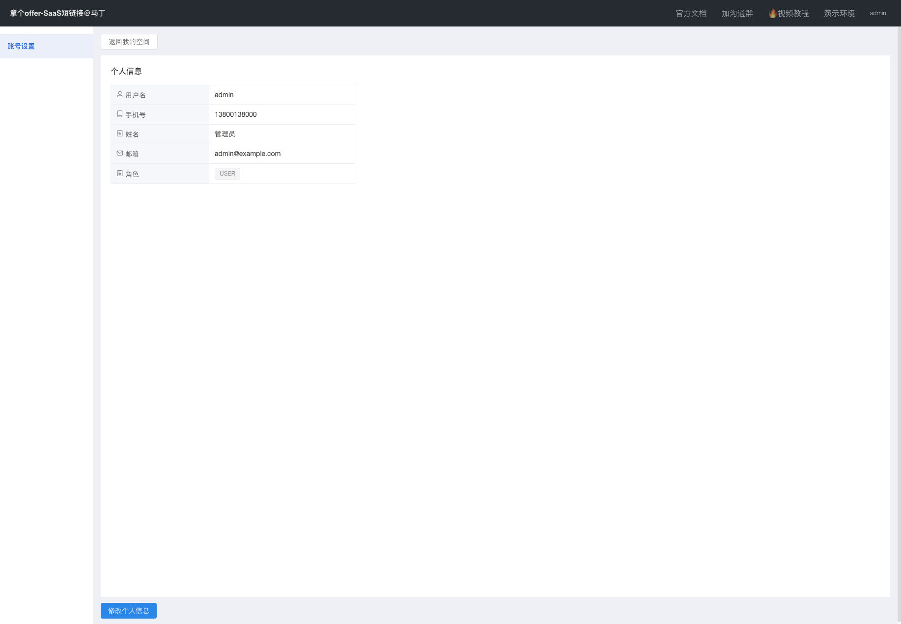
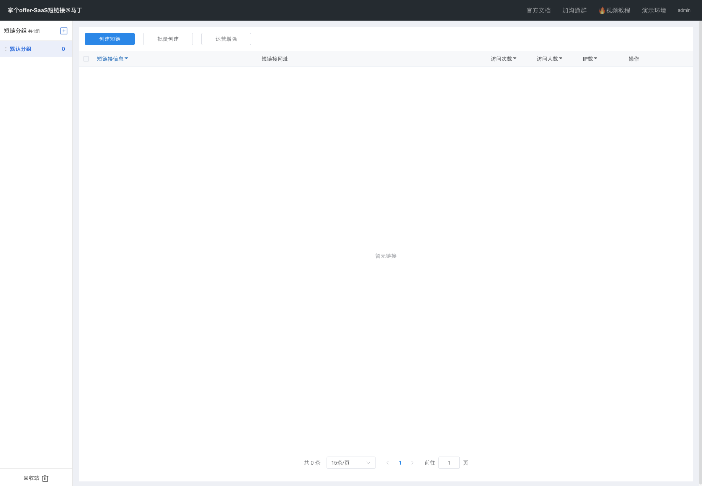
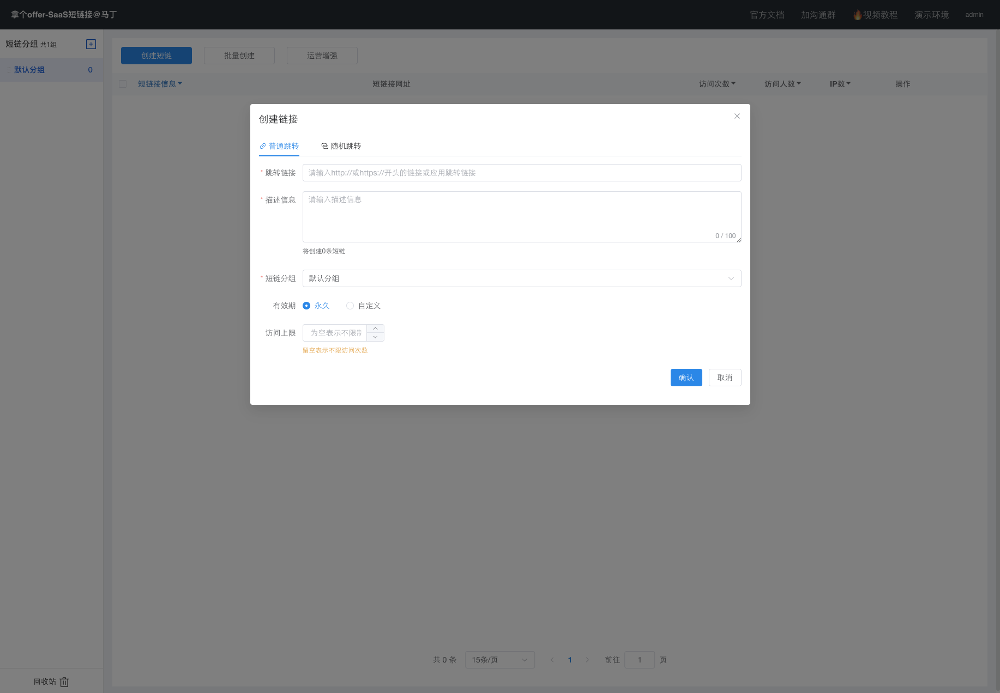
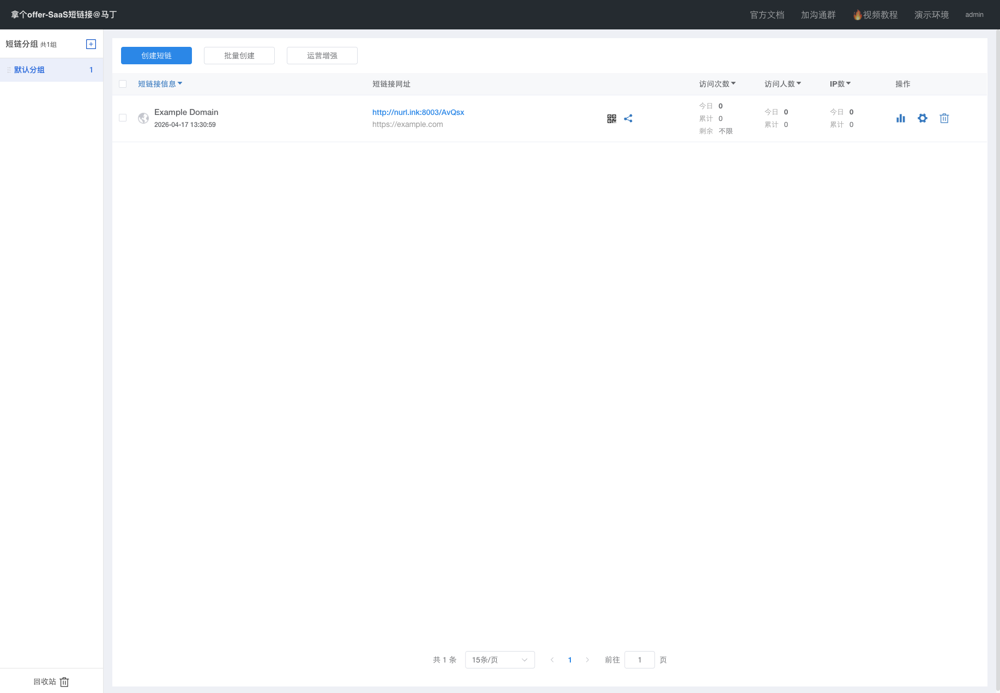
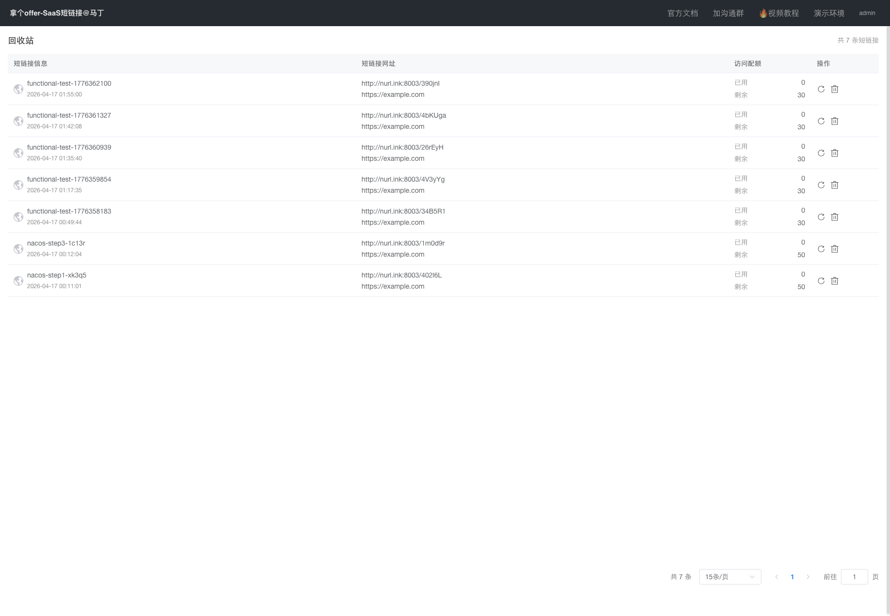
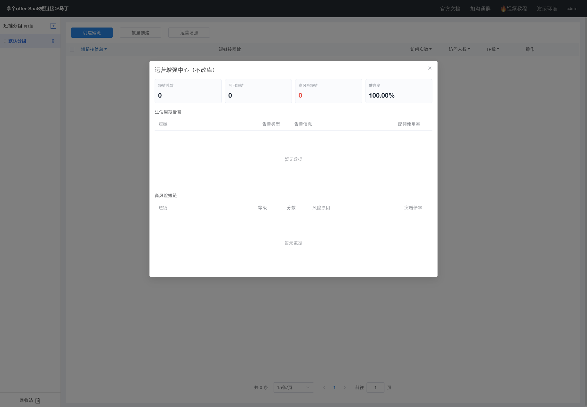

# 短链接系统基于 Service 层接口的功能说明

## 1. 文档说明

本文档不再单纯按照“页面”或“角色”组织，而是直接基于项目 `service` 层接口进行梳理。这样组织有两个好处：

- 更贴近系统真实实现，适合写入“系统实现”或“核心模块设计”章节。
- 更容易把“前端页面功能”和“后端接口职责”一一对应起来。

从当前项目结构来看，短链接系统主要由以下三层能力组成：

- `admin` 模块：负责用户、分组、管理台相关业务编排。
- `admin.remote` 抽象层：负责调用短链接核心能力，在单体模式下由本地实现承载。
- `project.service` 模块：负责短链接核心业务，例如创建短链、统计分析、回收站和 URL 标题解析。

因此，这份文档将以以下接口为主线进行展开：

- `UserService`
- `GroupService`
- `ShortLinkActualRemoteService`
- `ShortLinkService`
- `ShortLinkStatsService`
- `RecycleBinService`
- `UrlTitleService`

## 2. Service 层总体结构

### 2.1 管理侧服务

管理侧主要负责用户身份、分组管理、管理台页面能力封装，核心接口如下：

- `admin.service.UserService`
- `admin.service.GroupService`
- `admin.service.RecycleBinService`

### 2.2 短链接核心服务

核心短链接能力主要位于 `project.service` 包下，负责真正的短链接创建、跳转恢复、统计分析、回收站处理等逻辑，核心接口如下：

- `project.service.ShortLinkService`
- `project.service.ShortLinkStatsService`
- `project.service.RecycleBinService`
- `project.service.UrlTitleService`

### 2.3 远程能力抽象

在管理台侧，`ShortLinkActualRemoteService` 负责把“前台管理能力”和“核心短链接能力”连接起来。它本质上是一个聚合调用接口，用于统一承接：

- 创建短链
- 批量创建短链
- 查询短链列表
- 获取统计分析数据
- 处理回收站
- 获取标题
- 运营增强与风险分析

因此，从系统实现角度看，`ShortLinkActualRemoteService` 是“管理台”和“核心服务”之间的重要桥梁。

## 3. UserService：用户与认证服务

接口位置：`admin/src/main/java/com/nageoffer/shortlink/admin/service/UserService.java`

### 3.1 接口职责

`UserService` 主要负责系统用户的全生命周期管理，具体包括：

- 根据用户名查询用户信息 `getUserByUsername`
- 校验用户名是否存在 `hasUsername`
- 新用户注册 `register`
- 修改用户信息 `update`
- 更新用户角色 `updateRole`
- 用户登录 `login`
- 检查登录态 `checkLogin`
- 用户退出 `logout`

### 3.2 功能含义

从业务角度看，这个接口支撑了整个系统的认证入口与账户管理能力：

- 登录页中的账号密码登录，依赖 `login`
- 注册页中的用户名占用检查，依赖 `hasUsername`
- 登录后用户信息展示，依赖 `getUserByUsername`
- 个人中心资料修改，依赖 `update`
- 管理员维护角色，依赖 `updateRole`
- 路由守卫和登录态校验，依赖 `checkLogin`
- 退出登录，依赖 `logout`

### 3.3 对应前端表现

这个接口对应系统中的“登录页”和“个人中心”。

图 3-1 登录认证页面

图 3-2 个人中心页面

## 4. GroupService：短链接分组服务

接口位置：`admin/src/main/java/com/nageoffer/shortlink/admin/service/GroupService.java`

### 4.1 接口职责

`GroupService` 负责短链接分组管理，主要接口如下：

- 新增分组 `saveGroup`
- 查询当前用户分组列表 `listGroup`
- 修改分组 `updateGroup`
- 删除分组 `deleteGroup`
- 分组排序 `sortGroup`

### 4.2 功能含义

该接口用于解决“一个用户拥有多批短链接时如何分类管理”的问题。通过分组机制，系统可以：

- 将不同用途的短链接按业务分类
- 支持左侧导航快速切换分组
- 便于对某一组短链接做统一统计和管理
- 支持拖拽排序，提高工作台可用性

### 4.3 对应前端表现

在“我的空间”页面左侧，用户可以看到短链接分组区域；分组切换后，右侧表格内容会联动更新。

图 4-1 分组驱动的短链接工作台

## 5. ShortLinkActualRemoteService：管理台聚合调用服务

接口位置：`admin/src/main/java/com/nageoffer/shortlink/admin/remote/ShortLinkActualRemoteService.java`

### 5.1 接口职责

这是整个管理台最关键的能力聚合接口之一。它把短链接核心能力包装成管理台可直接调用的服务，主要包含以下几类接口：

- 短链接创建类
  - `createShortLink`
  - `batchCreateShortLink`
  - `updateShortLink`
  - `pageShortLink`
  - `listGroupShortLinkCount`

- 标题解析类
  - `getTitleByUrl`

- 回收站类
  - `saveRecycleBin`
  - `pageRecycleBinShortLink`
  - `recoverRecycleBin`
  - `removeRecycleBin`

- 统计分析类
  - `oneShortLinkStats`
  - `groupShortLinkStats`
  - `shortLinkStatsAccessRecord`
  - `groupShortLinkStatsAccessRecord`

- 运营增强类
  - `opsOverview`
  - `opsHighRisk`
  - `opsLifecycleAlerts`

### 5.2 功能含义

如果从系统设计角度理解，`ShortLinkActualRemoteService` 不是一个单一业务服务，而是一个“管理台视角的总能力入口”。它统一对接了：

- 工作台展示需要的数据
- 创建、编辑、删除短链需要的调用
- 图表统计查询需要的调用
- 回收站页面需要的调用
- 运营增强页面需要的调用

因此，在写毕业设计时，可以把这个接口理解为“管理端业务编排层”的核心抽象。

## 6. ShortLinkService：短链接核心业务服务

接口位置：`project/src/main/java/com/nageoffer/shortlink/project/service/ShortLinkService.java`

### 6.1 接口职责

`ShortLinkService` 是短链接系统最核心的服务接口，主要接口如下：

- 创建短链接 `createShortLink`
- 基于分布式锁创建短链接 `createShortLinkByLock`
- 批量创建短链接 `batchCreateShortLink`
- 修改短链接 `updateShortLink`
- 分页查询短链接 `pageShortLink`
- 查询分组内短链接数量 `listGroupShortLinkCount`
- 短链接跳转恢复 `restoreUrl`
- 短链接访问统计记录 `shortLinkStats`

### 6.2 功能含义

这个接口基本覆盖了短链接系统的主业务链路。

#### 1. 创建链路

用户在前端输入原始链接和描述后，系统调用：

- `createShortLink`：创建单条短链
- `batchCreateShortLink`：批量生成多条短链

其中，`createShortLinkByLock` 说明系统还考虑了并发下短链生成冲突的问题，体现出一定的工程化设计。

#### 2. 查询与维护链路

生成后的短链接会通过：

- `pageShortLink` 进行分页查询
- `updateShortLink` 进行编辑和修改
- `listGroupShortLinkCount` 统计不同分组下短链数量

#### 3. 跳转链路

`restoreUrl` 是系统运行时最核心的方法之一，负责根据短链后缀恢复原始地址并完成跳转。这一接口支撑了“短链真正可用”的核心能力。

#### 4. 统计链路

`shortLinkStats` 用于记录短链接访问行为，为后续的数据统计、趋势分析和运营增强提供底层数据来源。

### 6.3 对应前端表现

该接口对应“我的空间”的绝大多数核心功能。

图 6-1 短链接工作台主页面

图 6-2 创建短链接功能

## 7. ShortLinkStatsService：短链接统计分析服务

接口位置：`project/src/main/java/com/nageoffer/shortlink/project/service/ShortLinkStatsService.java`

### 7.1 接口职责

`ShortLinkStatsService` 负责短链接访问统计与行为分析，主要接口如下：

- 查询单个短链接统计数据 `oneShortLinkStats`
- 查询分组短链接统计数据 `groupShortLinkStats`
- 查询单个短链接访问记录 `shortLinkStatsAccessRecord`
- 查询分组访问记录 `groupShortLinkStatsAccessRecord`

### 7.2 功能含义

这组接口让系统不再只是一个“链接压缩工具”，而是一个具备数据分析能力的平台。它主要提供以下能力：

- 从单条短链角度分析访问效果
- 从整个分组角度分析投放效果
- 按时间范围查看趋势变化
- 查询具体访问记录
- 为图表、表格和运营分析提供数据基础

### 7.3 对应前端表现

在“我的空间”页面中点击图表入口后，会弹出短链接统计分析弹窗，展示访问次数、访问人数、IP 数以及历史访问记录等内容。

图 7-1 短链接统计分析页面

## 8. project.RecycleBinService：核心回收站服务

接口位置：`project/src/main/java/com/nageoffer/shortlink/project/service/RecycleBinService.java`

### 8.1 接口职责

核心回收站接口主要包含：

- 保存到回收站 `saveRecycleBin`
- 分页查询回收站数据 `pageShortLink`
- 从回收站恢复 `recoverRecycleBin`
- 从回收站彻底移除 `removeRecycleBin`

### 8.2 功能含义

这一组接口体现了短链接删除并非“直接物理删除”，而是先进入回收站，再由用户决定：

- 是否恢复
- 是否彻底删除

这种设计可以提升数据安全性，避免误删造成的数据损失。

### 8.3 对应前端表现

图 8-1 回收站页面

## 9. admin.RecycleBinService：管理台回收站查询服务

接口位置：`admin/src/main/java/com/nageoffer/shortlink/admin/service/RecycleBinService.java`

### 9.1 接口职责

相比核心模块中的回收站服务，管理台侧的 `RecycleBinService` 更偏向“页面查询能力”，当前接口较聚焦：

- 分页查询回收站短链接 `pageRecycleBinShortLink`

### 9.2 功能含义

这个接口说明管理台侧并不直接承担全部回收站处理逻辑，而是更专注于：

- 为页面提供回收站分页展示结果
- 调用底层能力完成数据加载

这体现出系统分层设计中“管理编排层”与“核心业务层”的职责分离。

## 10. UrlTitleService：URL 标题解析服务

接口位置：`project/src/main/java/com/nageoffer/shortlink/project/service/UrlTitleService.java`

### 10.1 接口职责

该接口只有一个方法：

- 根据 URL 获取网页标题 `getTitleByUrl`

### 10.2 功能含义

虽然接口非常简单，但它在用户体验上很有价值。创建短链接时，系统可以通过目标 URL 自动提取网页标题，用于：

- 辅助补全短链描述
- 提高列表展示的可读性
- 减少用户手工录入成本

这个接口属于典型的“辅助增强功能”，实现简单但使用价值高。

## 11. 运营增强能力的接口归属

在当前项目中，运营增强相关能力主要体现在 `ShortLinkActualRemoteService` 中的三个接口：

- `opsOverview`
- `opsHighRisk`
- `opsLifecycleAlerts`

它们分别对应：

- 分组运营总览
- 高风险短链识别
- 生命周期告警分析

从设计角度看，这说明运营增强并不属于底层最基础的 CRUD 服务，而是构建在短链接数据、统计数据和业务规则之上的“高阶分析能力”。

其前端表现如下：

图 11-1 运营增强中心

## 12. 从 Service 接口看系统主流程

如果按一次完整业务流程来理解这些接口，可以概括为：

### 12.1 用户进入系统

- `UserService.login`
- `UserService.checkLogin`
- `UserService.getUserByUsername`

### 12.2 用户管理分组

- `GroupService.listGroup`
- `GroupService.saveGroup`
- `GroupService.updateGroup`
- `GroupService.sortGroup`

### 12.3 用户创建并维护短链接

- `ShortLinkActualRemoteService.createShortLink`
- `ShortLinkActualRemoteService.batchCreateShortLink`
- `ShortLinkActualRemoteService.pageShortLink`
- `ShortLinkActualRemoteService.updateShortLink`

其底层对应：

- `ShortLinkService.createShortLink`
- `ShortLinkService.batchCreateShortLink`
- `ShortLinkService.pageShortLink`
- `ShortLinkService.updateShortLink`

### 12.4 用户查看统计分析

- `ShortLinkActualRemoteService.oneShortLinkStats`
- `ShortLinkActualRemoteService.groupShortLinkStats`
- `ShortLinkActualRemoteService.shortLinkStatsAccessRecord`
- `ShortLinkActualRemoteService.groupShortLinkStatsAccessRecord`

其底层对应：

- `ShortLinkStatsService.oneShortLinkStats`
- `ShortLinkStatsService.groupShortLinkStats`
- `ShortLinkStatsService.shortLinkStatsAccessRecord`
- `ShortLinkStatsService.groupShortLinkStatsAccessRecord`

### 12.5 用户删除或恢复短链接

- `ShortLinkActualRemoteService.saveRecycleBin`
- `ShortLinkActualRemoteService.pageRecycleBinShortLink`
- `ShortLinkActualRemoteService.recoverRecycleBin`
- `ShortLinkActualRemoteService.removeRecycleBin`

其底层对应：

- `project.RecycleBinService.saveRecycleBin`
- `project.RecycleBinService.pageShortLink`
- `project.RecycleBinService.recoverRecycleBin`
- `project.RecycleBinService.removeRecycleBin`

### 12.6 系统进行跳转与行为记录

- `ShortLinkService.restoreUrl`
- `ShortLinkService.shortLinkStats`

这一部分是短链接系统线上运行阶段的关键链路。

## 13. 结论

基于 `service` 层接口来看，当前短链接系统已经形成了较清晰的分层结构：

- `UserService` 负责认证与用户管理
- `GroupService` 负责分组管理
- `ShortLinkService` 负责短链接核心业务
- `ShortLinkStatsService` 负责统计分析
- `RecycleBinService` 负责回收站管理
- `UrlTitleService` 负责标题解析增强
- `ShortLinkActualRemoteService` 负责将核心能力统一编排给管理台使用

如果用于毕业设计文档，这种写法非常适合放在“系统功能实现”或“后端核心模块设计”章节中。相比单纯按页面介绍，这种写法更加工程化，也更能体现你对项目源码结构和业务分层的理解。
