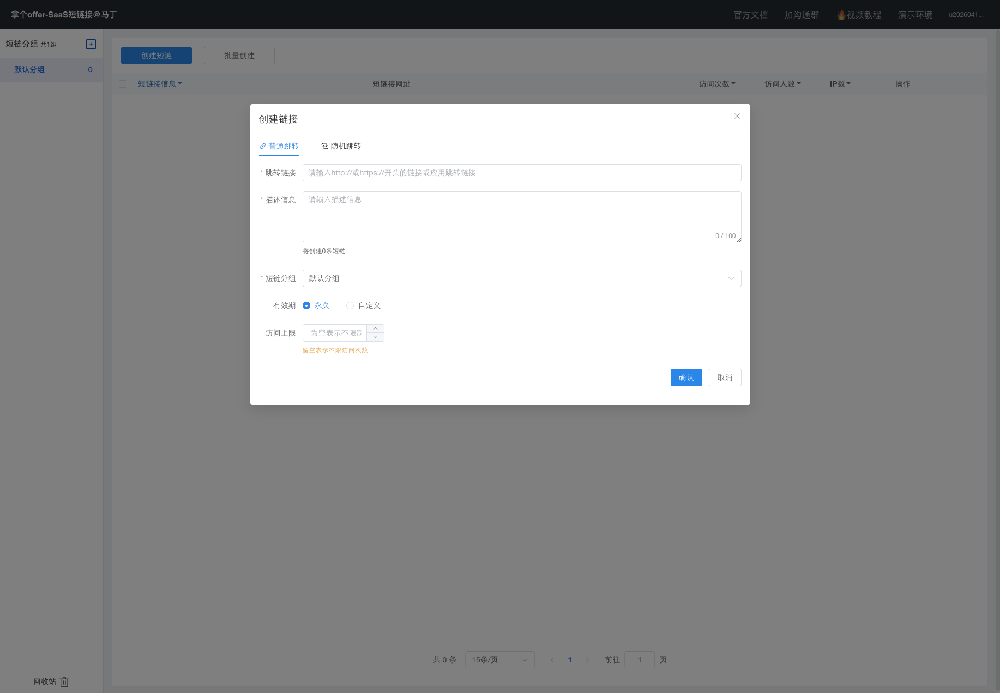

# 短链接生成模块（论文版）

## 1. 功能介绍
短链接生成模块负责把用户输入的原始长链接转换为可分发的短链接地址，并同时完成业务属性初始化。该模块在系统中承担两个核心目标：一是提供高并发下稳定的生成能力，二是保证短链标识在业务生命周期内的唯一性与可管理性。

从产品能力看，创建时支持以下关键属性：
- 分组（`gid`）归属
- 有效期策略（永久/指定时间）
- 访问上限（配额）
- 描述信息与图标抓取

该模块对应的前端交互入口见下图（创建弹窗）：

## 2. 流程介绍
短链接生成流程可分为 7 个阶段：
1. 管理台提交创建请求（携带原始链接与业务参数）。
2. 聚合层转发到 `project` 领域服务。
3. 执行白名单校验（演示环境安全约束）。
4. 生成短码候选值（`MurmurHash32 + Base62`）。
5. 布隆过滤器预判冲突，必要时重试。
6. 事务内写入 `t_link` 与 `t_link_goto` 双表。
7. 回填 Redis 跳转缓存并返回短链接。

创建后在列表中的呈现效果如下：

## 3. 具体原理
### 3.1 短码生成原理
- 采用 `originUrl + UUID` 作为输入，降低同源输入热点冲突概率。
- 使用 MurmurHash 计算散列，再通过 Base62 编码得到短后缀。
- 若候选短码在布隆过滤器中疑似存在，则继续重试。

### 3.2 一致性原理
- 事务保证双表原子写入，避免“主记录存在但路由缺失”。
- 数据库唯一约束作为最终裁决，布隆过滤器仅做性能优化层。
- 缓存后置写入（DB 成功后再写缓存），确保“数据库是真相源”。

### 3.3 并发原理
- 常态路径走无锁高吞吐模式。
- 冲突敏感场景可切换加锁模式（串行化生成窗口），提升稳态成功率。

## 4. 设计思路
本模块设计遵循“分层解耦 + 双重防冲突 + 事务兜底”的工程策略：
- 分层解耦：控制层、聚合层、领域层职责清晰，便于后续架构演进。
- 双重防冲突：布隆过滤器减少无效写库，唯一键保证最终正确性。
- 事务兜底：通过双表原子提交保证可追踪、可恢复、可统计。
- 缓存协同：写后预热降低后续跳转延迟，服务高频读场景。

综上，短链接生成模块不仅实现了“从长到短”的功能转换，还通过概率结构、数据库约束与缓存策略协同，形成了可在高并发条件下稳定运行的创建链路。
