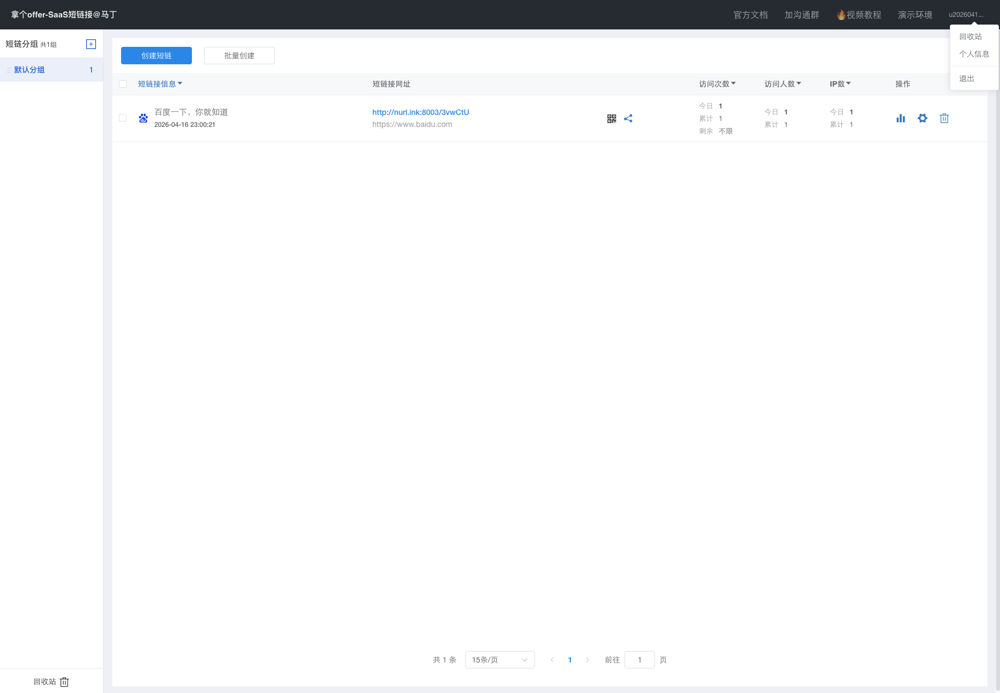

# 短链接跳转模块（论文版）

## 1. 功能介绍
短链接跳转模块负责处理终端用户访问短链时的实时重定向。其目标不是简单返回 302，而是在保证低延迟的同时完成有效性校验、配额控制与访问统计采集。

该模块需在高并发读请求下保持稳定，因此设计重点是“尽量在缓存层完成决策，尽量减少数据库回源次数”。

跳转链路的业务效果与监控链路关联如下图所示：

## 2. 流程介绍
短链跳转流程可抽象为“多级短路决策”：
1. 解析请求得到 `fullShortUrl`。
2. 查询 Redis 正向缓存（命中则直接进入跳转）。
3. 查询空值缓存（命中则快速失败）。
4. 布隆过滤器预判（明确不存在则快速失败）。
5. 进入分布式锁区间，执行缓存双检。
6. 回源 DB 查 `t_link_goto + t_link`，校验状态与有效期。
7. 进行访问配额原子扣减。
8. 异步发送统计事件，返回 302 重定向。

跳转后的统计结果可在空间页统计区看到：

## 3. 具体原理
### 3.1 性能原理
- 采用“正向缓存 + 空值缓存 + 布隆过滤器”三级防穿透。
- 在回源前先过滤无效请求，保护数据库。
- 锁内双检降低缓存击穿时的并发回源放大。

### 3.2 正确性原理
- 访问配额使用单条条件更新 SQL（`current_access_count < max_access_count`）原子扣减。
- 超限后将短链禁用并写空值缓存，实现状态快速收敛。
- 有效期与启用状态在回源时统一裁决，避免脏跳转。

### 3.3 统计原理
- 统计不阻塞跳转主路径，采用异步消息（Redis Stream）解耦。
- UV 基于 Cookie + Redis Set 判重，UIP 基于 IP + Redis Set 判重。
- 通过“业务口径一致”保证统计可解释性，而非追求账号体系级唯一。

## 4. 设计思路
跳转模块设计遵循“快路径优先、慢路径可控、统计异步化”原则：
- 快路径优先：缓存命中即返回，最大化读吞吐能力。
- 慢路径可控：通过锁和双检控制异常并发成本。
- 失败可缓存：无效短链状态写入空值缓存，防止重复回源。
- 统计异步化：用户体验优先，统计最终一致。

该设计保证了短链系统在真实访问洪峰下仍能保持低延迟与高稳定性，同时兼顾统计分析和治理能力。
